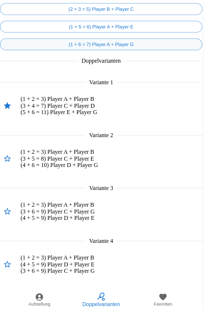

# DoublesUp! Tennis Doubles Match Making Assistant

This project is a **prototype** of a *Next.js* application designed to assist in lining up doubles in tennis teams. The application is built with the rules of the German Tennis Association (DTB) in mind.

## Limitations

The app is currently limited to teams of six player

## Features

- **Player Selection**: The application allows you to add and select the players who will participate in the doubles round. The list of players must reflect the team registration list. Once six players are selected, all possible combinations are listed.

- **Favorites**: You can mark certain combinations as favorites. This feature is particularly useful when a team has more than six players. In such cases, the favorite combinations are grouped according to their respective lineups.

## Insights

### Lineup

### Player Combinations

### Favorites

